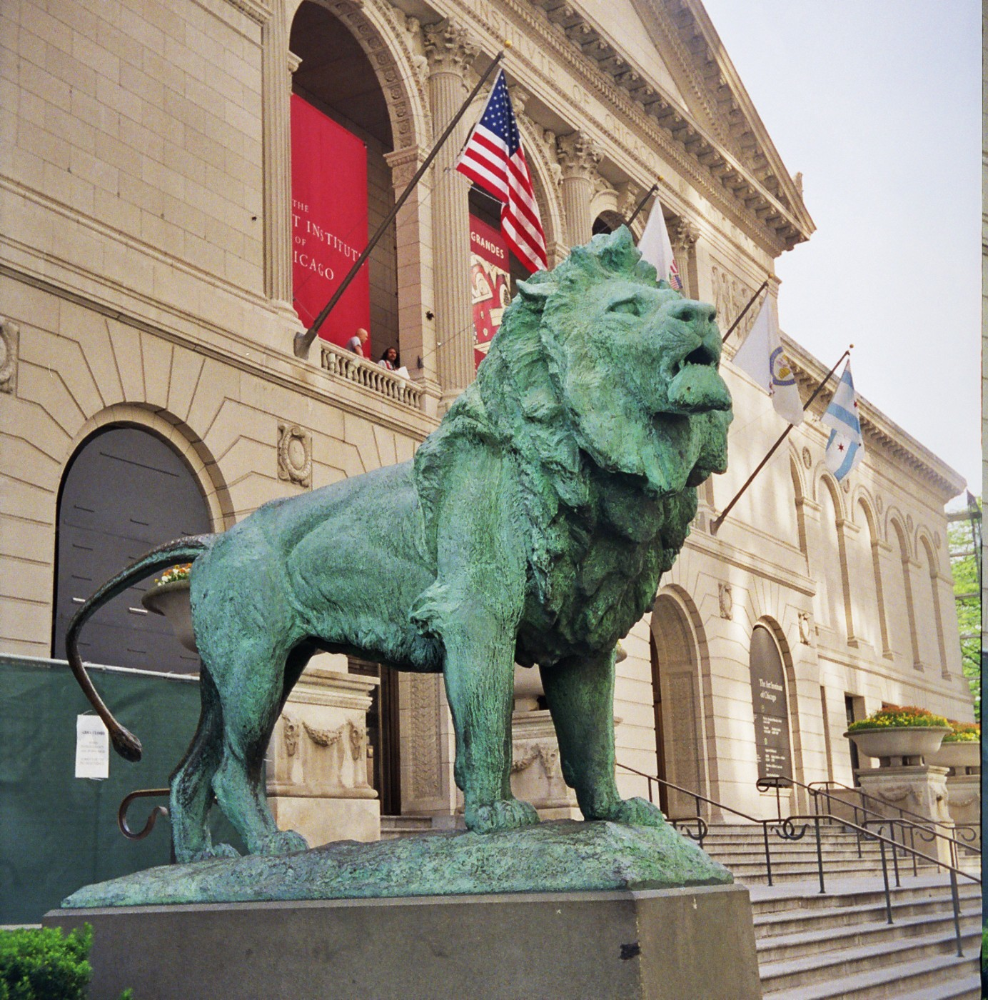
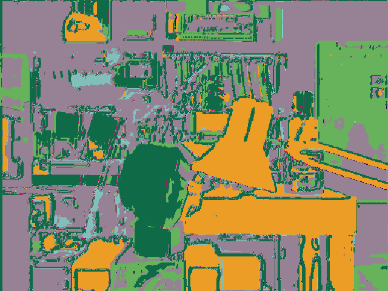

# Unsupervised image segmentation based on depth and normal maps clustering

## Examples
| 0000.png                         | 0001.png                         | 0002.png                         |
| -------------------------------- | -------------------------------- | -------------------------------- |
|      |      |      |
|  |  |  |

## Results
Epoch: 20, loss=(total:1.8018 c:0.3810 s:1.4208)
IOU=0.9285      
PRECISION=0.9273        
RECALL=1.0000        
F1=0.9620

Trained on [bdataset](https://drive.google.com/drive/folders/1IlFDUHxvjXrwdo9GdHM764n9HKwnzfml) for 5 epochs
and [bdataset_scene](https://github.com/alexjercan/unsupervised-segmentation/releases/tag/v1.0) for 20 epochs.
Train Configuration
```yaml
LEARNING_RATE: 1e-5
BETAS: [0.9, 0.999]
EPS: 1e-8
WEIGHT_DECAY: 1e-4

MILESTONES: [10]
GAMMA: 0.1

NUM_EPOCHS: 20
```

**Google Colab** notebook: <a href="https://colab.research.google.com/github/alexjercan/unsupervised-segmentation/blob/master/tutorial.ipynb"></a>

## References
- [Unsupervised Learning of Image Segmentation Based on Differentiable Feature Clustering](https://arxiv.org/pdf/2007.09990.pdf)
